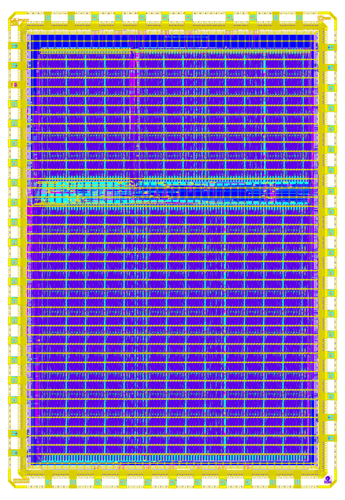
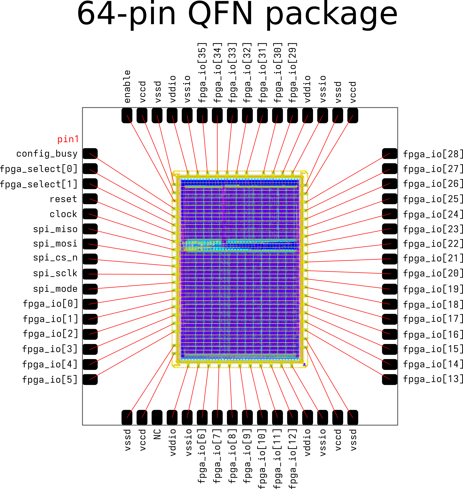

# sky130 FABulous Test Chip

A test chip with three FABulous FPGA fabrics.

<p align="center">
  <a href="img/chip_top.png">
    
  </a>
</p>

The following FPGA fabrics are available:

- classic_fabric_chipfoundry_small
  - 192x FABULOUS_LC
- classic_fabric_chipfoundry_medium
  - 288x FABULOUS_LC
  - 6x RAM_32x4_2R_1W
  - 3x MACC_8x8_20
- classic_fabric_chipfoundry_large
  - 1056x FABULOUS_LC
  - 12x RAM_32x4_2R_1W
  - 6x MACC_8x8_20

The chip will be packaged using ChipFoundry's QFN service:

<p align="center">
  <a href="img/bonding_diagram.png">
    
  </a>
</p>

| Pin   | Name           | Description                                   |
|-------|----------------|-----------------------------------------------|
| 1     | config_busy    | High during fabric configuration operation.   |
| 2     | fpga_select[0] | fpga_select[1:0] is used to select the active fabric. |
| 3     | fpga_select[1] | 2'd0 = Large, 2'd1 = Small, 2'd2 = Medium, 2'd3 = None |
| 4     | reset          | Active low reset.                             |
| 5     | clock          | Clock signal. Configuration up to 10MHz.      |
| 6     | spi_miso       | SPI MISO                                      |
| 7     | spi_mosi       | SPI MOSI                                      |
| 8     | spi_cs_n       | SPI CS_N                                      |
| 9     | spi_sclk       | SPI SCLK                                      |
| 10    | spi_mode       | Pull down = active SPI, Pull up = passive SPI |
| 11-16 | fpga_io[5:0]   | FPGA I/O                                      |
| 22-28 | fpga_io[12:6]  | FPGA I/O                                      |
| 33-48 | fpga_io[28:13] | FPGA I/O                                      |
| 53-59 | fpga_io[35:29] | FPGA I/O                                      |
| 64    | enable         | Enable signal for the I/Os. Must use I/O domain and should be kept low during startup. |
| 18, 31, 49, 63 | vccd           | Core Power (1.8V)                    |
| 17, 32, 50, 62 | vssd           | Core Ground                          |
| 20, 29, 52, 61 | vddio          | I/O Power (3.3V - 5.0V)              |
| 21, 30, 51, 60 | vssio          | I/O Ground                           |


> [!NOTE]
> To build the chip, enable the following PDK version using ciel: d815bb30c9afdf9e264c276a8a2b533108dea3d0
> In addition the following LibreLane branch must be used: `nix shell github:librelane/librelane/dev`


This repository contains a collection of fabrics using the [fabulous-tiles](https://github.com/mole99/fabulous-tiles) tile libraries.

The fabrics can be found under `fabrics/`. Current fabrics include:

- classic_fabric_chipfoundry_small
- classic_fabric_chipfoundry_medium
- classic_fabric_chipfoundry_large

The prefix describes the tile library that is used, in this case `classic`.

The fabrics can be implemented with LibreLane using the FABulous plugin for LibreLane: [librelane_plugin_fabulous](https://github.com/mole99/librelane_plugin_fabulous).
See below for more information about stitching the fabric. 

A Continuous Integration (CI) setup implements the fabrics for the sky130A PDK.

## Requirements

> [!NOTE]
> Make sure to clone the repository with submodules!
>
>```console
>git clone --recurse-submodules <url>.git
>```
> or initialize the submodules after cloning:
>
>```console
> git submodule update --init --recursive
>```

For information on installing Nix with the FOSSi Foundation cache, please refer to the LibreLane documentation: https://librelane.readthedocs.io/en/stable/installation/nix_installation/index.html

## Stitch the Fabrics

As a prerequisite make sure that the tiles for the tile library that you are using have been implemented in `ip/fabulous-tiles`.
If that is the case, you can proceed by enabling a Nix shell with LibreLane in this repository:

```
nix-shell
```

To implement all fabrics, run:

```
make all
```

To implement a single fabric, run:

```
make classic_fabric_chipfoundry_large
```

After a fabrics has been implemented you can view it either in OpenROAD or KLayout by appending `-openroad` or `-klayout` to the fabric name.
For example, to view `classic_fabric_chipfoundry_large` in OpenROAD, run: `make classic_fabric_chipfoundry_large-openroad`.

## Implement User Designs

Please see the README in `user_designs/` on how to implement a user design for the fabrics.

## Simulate the Fabric

After you have generated the bitstreams for the user designs you can simulate the fabric.
You will again need the Nix shell from the root of this repository.

Again, use `PDK`, `FABRIC` and `TILE_LIBRARY` accordingly.

There are two ways to simulate the fabric:

#### RTL "Emulation"

In this case, "emulation" means that we simulate the fabric, however, without uploading the bitstream.
The configuration bits of the fabric are already initialized with the user design bitstream.
This has the benefit that simulation is much faster: no need to upload the bitstream and the Verilog simulator can prune dead branches. However, the disadvantage is that only a single user design can be run per simulation.

To emulate a user design, simply set EMULATE to its name:

```
export EMULATE=counter
```

Then, run the simulation using cocotb:

```
cd tb; python3 fabric_tb.py
```

#### RTL Simulation

To start the RTL simulation, simply run cocotb:

```
cd tb; python3 fabric_tb.py
```

And it will run all available test cases for the selected fabric and tile library.
